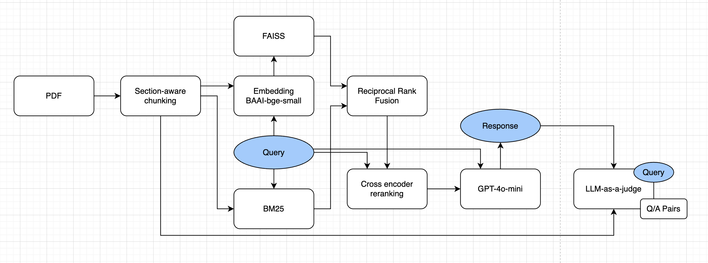

# Long Document Q&A System

A retrieval-augmented generation (RAG) system for answering questions over a single long document (100+ pages), with cited evidence. Tested on the Microsoft FY2023 10-K (116 pages).

---

## Problem framing
A 100 page PDF may contain dense prose, multi-column tables, and the same concepts repeated over again. In order to reflect the difficulty of parsing such PDFs, a finance document (Microsoft's 2023 10-K) was chosen as it contains all of the difficulties above, making it a good testing ground for our RAG system.

Long documents cannot be stuffed into an LLM context window without potential context loss. I scoped the solution as a retrieval-augmented pipeline: offline ingestion and indexing, hybrid retrieval at query time, and generation constrained to retrieved context only.

## System design

**Ingestion**. 
PyMuPDF extracts per-span font size and bold flags, which are sufficient to detect headings typographically. Header/footer zones and footnote-size text are filtered. Tables are detected via PyMuPDF's `find_tables()` and kept as atomic text blocks, preventing table header cells from being misread as section headings. Each chunk carries section, page_start, and page_end through to the final answer. These typographic heuristics can be tuned in config.py and generalize to most single-column documents. 500-token chunks with 100-token overlap was chosen as a default for documents where context preservation across chunks matters.

**Indexing**. 
BAAI/bge-small-en-v1. was used as the embedding model as it is fast, free, and is fully local for IP leakage concerns. In production, this can be swapped for Azure OpenAI.  
FAISS and BM25 were chosen as they complement each other's weaknesses and are the industry standards for semantic and syntactic search.  
Section and pages are prepended at embedding time for FAISS, but no prepend for BM25 to avoid polluting keyword matching.

**Retrieval**. 
Dense and sparse each return top 50 candidates, fused with RRF (k=60). This provides coverage that neither provides alone. The cross-encoder reranker (ms-marco-MiniLM-L-6-v2) then reads (query, chunk) pairs jointly, outputting a relevance score between them and returns the final top-10.

**Generation**. 
GPT-4o-mini at temperature=0. 4o-mini was chosen for its cost effectiveness at prototyping, and can be swapped to local LLMs or Azure OpenAI for IP privacy. The prompt engineering enforces citation by source number, prohibits extrapolation beyond retrieved context, and requires an explicit "not in sources" response for unanswerable questions.

## Evaluation
Evaluation was inspired by RAGAS, and scored on 3 binary dimensions. Retrieval (do the retrieved chunks contain enough information to answer the question?), Correctness (is the answer factually right, compared against the reference answer?), and Faithfulness (does every claim in the answer stay within the retrieved chunks?). The retrieval and generation split allows us to diagnose where the system is failing and make appropriate changes. Questions answer pairs were classified by question type and tagged as table/prose.

**Table 1 - Results by Dimension**. 
| Dimension | Passed | Total | Pass Rate |
|---|---|---|---|
| Retrieval | 35 | 36 | 97% |
| Correctness | 35 | 40 | 88% |
| Faithfulness | 40 | 40 | 100% |

**Table 2 - Correctness by Question Type**. 
| Question Type | Passed | Total | Pass Rate |
|---|---|---|---|
| Cross-section | 3 | 4 | 75% |
| Factoid | 18 | 18 | 100% |
| Multi-hop | 6 | 8 | 75% |
| Negative | 3 | 4 | 75% |
| Superlative | 5 | 6 | 83% |

**Table 3 - Adversarial Question Set:**
| Dimension | Passed | Total | Pass Rate |
|---|---|---|---|
| Retrieval | 16 | 18 | 89% |
| Correctness | 13 | 20 | 65% |
| Faithfulness | 20 | 20 | 100% |

**Ablation:** top-k 5 -> 10: Correctness 80% -> 88%
 
## Setup
**Requirements:** Python 3.11+
```bash
git clone <repo-url>
cd <repo-name>
python -m venv venv
source venv/bin/activate        # Windows: venv\Scripts\activate
pip install -r requirements.txt
```
Create a `.env` file in the project root:

```
OPENAI_API_KEY=sk-...
```

The first run will download the embedding model and cross-encoder from Hugging Face.

## How to run
**Step 1 — Ingest a document** (run once per document):
```bash
python -m src.main ingest data/MICROSOFT_2023_10K.pdf
```

**Step 2 — Ask questions:**
Interactive REPL:
```bash
python -m src.main query
```

**Run the eval suite:**
```bash
python -m src.evaluate questions.json               # standard 40-question set
python -m src.evaluate questions_adversarial.json   # adversarial set
```

Results are written to `eval/results/eval_{timestamp}.json`.

## Assumptions and Limitations
- **Text-based PDFs only.** The pipeline uses PyMuPDF text extraction. Scanned documents require OCR preprocessing/VLMs. Charts and figures are not handled. Assuming text-based PDFs, this setup is domain-agnostic, with no finance-specific libraries or prompts.
- **Single-column layout assumed.** Heading detection heuristics are tuned for single-column structured documents. Multi-column layouts (e.g. research paper style) may produce incorrect section boundaries.
- **Tables are ingested as text blocks.** Numbers lose row/column context after chunking. This is the dominant remaining failure mode on numerical queries.
- **Approximate token counting.** Chunk size is enforced using a `chars_per_token = 4` approximation rather than a tokeniser. This is accurate for standard English prose but may overestimate token counts for heavily numeric content, potentially producing chunks shorter than intended.


## Future Improvements

- **Structured table extraction.** Replace atomic table-block ingestion with structured row/column parsing with VLMs or MinerU. Fixes the dominant failure class, which are numerical queries where numbers lose their row/column context after chunking.
- **Table-aware chunking.** Currently tables are detected via bounding boxes but still subject to fixed 500-token chunking, which can split a table mid-row and lose row/column relationships. A proper implementation would keep each table as an atomic chunk regardless of size, if not using structured table extraction as above.
- **Query decomposition.** Detect comparison or superlative intent and issue one sub-query per entity before merging results. Fixes failures on queries with no named anchor (e.g. "which segment declined?") where single-query dense retrieval has no signal to pull any specific chunk. Q20 is a good example of where the current model struggles and where query decomposition will benefit the most.
- **HyDE (Hypothetical Document Embeddings).** If a query uses derived terminology while the document uses a different phrasing, retrieval will miss. In Q43, for "free cash flow", the system never retrieved the cash flow statement as capex is recorded as "additions to property and equipment", not "capital expenditures". A HyDE hypothetical answer would naturally contain that native phrasing and embed closer to the right page, addressing queries with vocabulary mismatch.
- **Contextual enrichment.** Prepend LLM-generated section summaries to chunks before embedding, so each chunk carries its surrounding context at retrieval time. This is akin to the approach used in Anthropic's contextual retrieval technique, without the entire document to the LLM per call.
